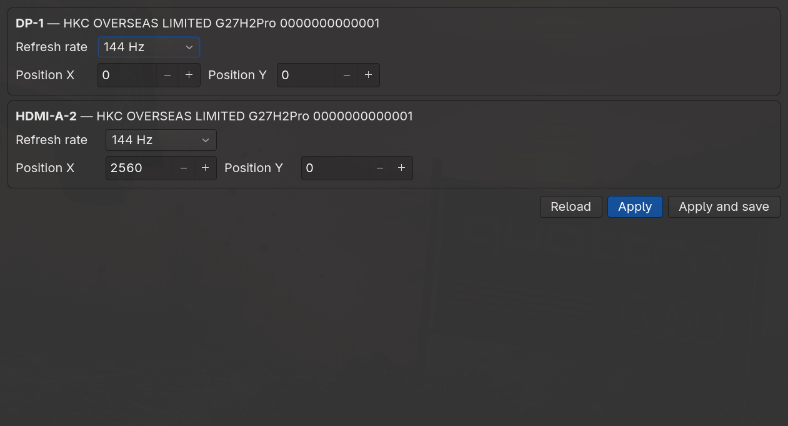

<div align="center">

# Omarchy Multi-Monitor Toolkit

**A complete multi-monitor setup for [Omarchy](https://omarchy.org/) (Arch Linux + Hyprland) —**
**with a settings GUI, Windows-style window movement, and hands-free dotfile backups.**




</div>

---

## ✨ Features

### 🖥️ Monitor Settings GUI
A native GTK4 application — no more editing config files by hand:

- **Refresh rate picker** per monitor, populated live from the compositor (60 / 120 / 144 Hz …)
- **Position X / Y controls** to arrange monitors side by side or stacked
- **Apply** for instant changes, **Apply and save** to persist them (with automatic timestamped config backups)
- Validates after every save and surfaces any config errors

### 🪟 Windows-style window movement
`Super + Ctrl + Shift + Arrow` sends the focused window to the nearest monitor in that direction —
exactly like `Win + Shift + Arrow` on Windows. At an edge monitor it does nothing, just like Windows.
Works for tiled and floating windows alike; focus follows the window.

### ☁️ Effortless dotfile backup
A git-based config backup that maintains itself:

- `post-update.d` hook runs after every `omarchy update`, commits and pushes automatically
- Manual saves push too, with a network-safe timeout so an offline machine is never blocked
- Restore on a fresh install with one clone and one script

## 🚀 Quick start

```bash
git clone https://github.com/pandaxiong24/omarchy-multi-monitor ~/.dotfiles
~/.dotfiles/install.sh              # --dry-run to preview
omarchy hook install post-update ~/.dotfiles/post-update.hook
omarchy restart shell               # if the shell/bar was customized
```

After this, every config change is committed and pushed by the hook — or run
`~/.dotfiles/save.sh` manually anytime.

## ⌨️ Keybindings

| Keys | Action |
|---|---|
| `Super + Ctrl + Shift + ←/→/↑/↓` | Move active window to the monitor in that direction |
| `Super + SHIFT + ←/→/↑/↓` | Swap window with neighbour tile (Omarchy default) |
| `Super + /` · `Super + Alt + /` | Monitor scale up / down (Omarchy default) |

## 📦 What's inside

| Path | Restores to | What it is |
|---|---|---|
| `config/hypr/` | `~/.config/hypr/` | Hyprland config: `monitors.lua`, `bindings.lua`, look & feel |
| `config/omarchy/` | `~/.config/omarchy/` | Omarchy shell layout, plugins, extensions, branding |
| `local/bin/omarchy-monitor-settings` | `~/.local/bin/` | The GTK4 monitor settings app |
| `local/bin/omarchy-hyprland-window-move-monitor` | `~/.local/bin/` | Move-window-to-monitor helper |
| `local/share/applications/Monitor Settings.desktop` | `~/.local/share/applications/` | Launcher entry |

## 🧰 Requirements

- Omarchy (or any Arch system running Hyprland with Lua config support)
- Python `gtk4` bindings: `python-gobject`, `gtk4`
- `grim` (screenshots), `rsync`, `jq` — already part of Omarchy

---

<div align="center">
Built on <a href="https://omarchy.org">Omarchy</a> · <a href="https://hypr.land">Hyprland</a>
</div>
